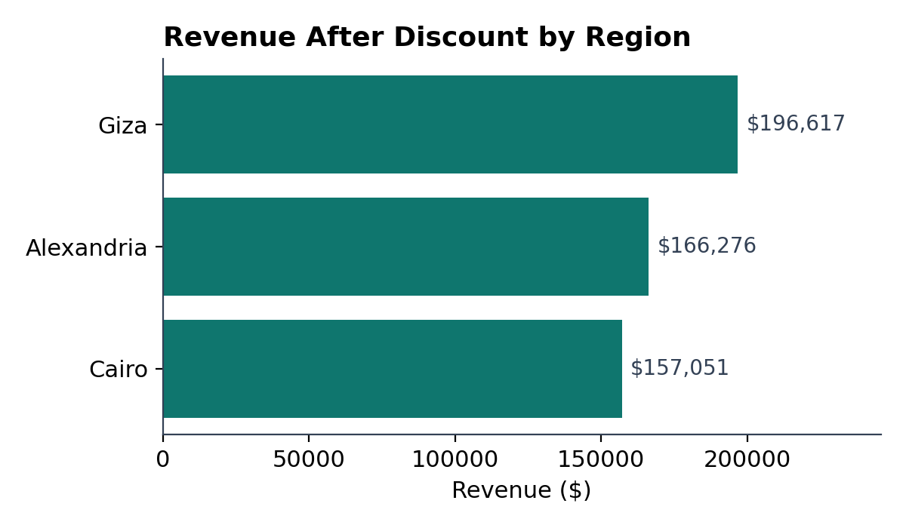
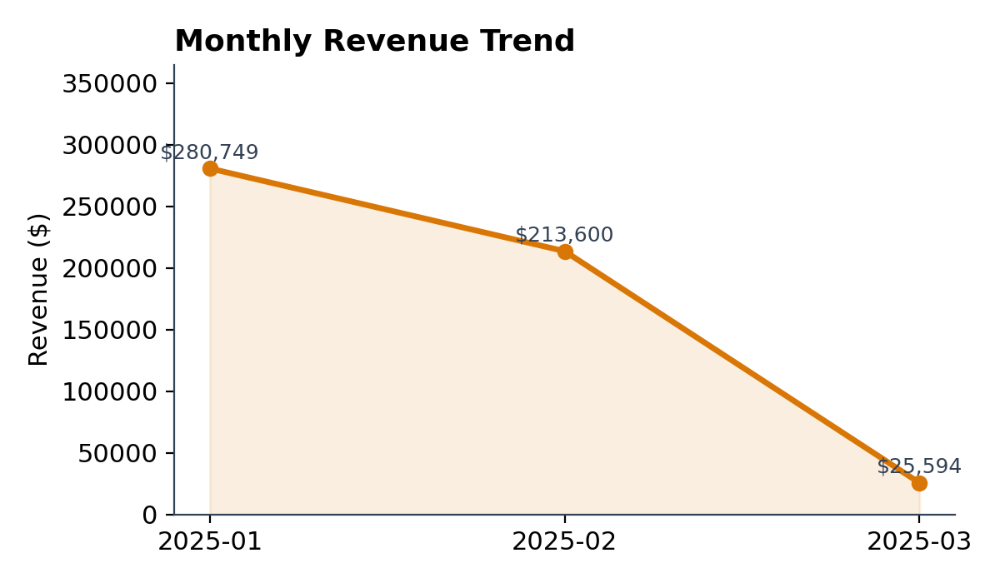
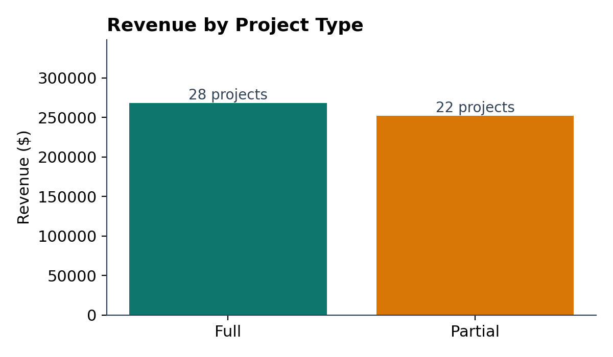
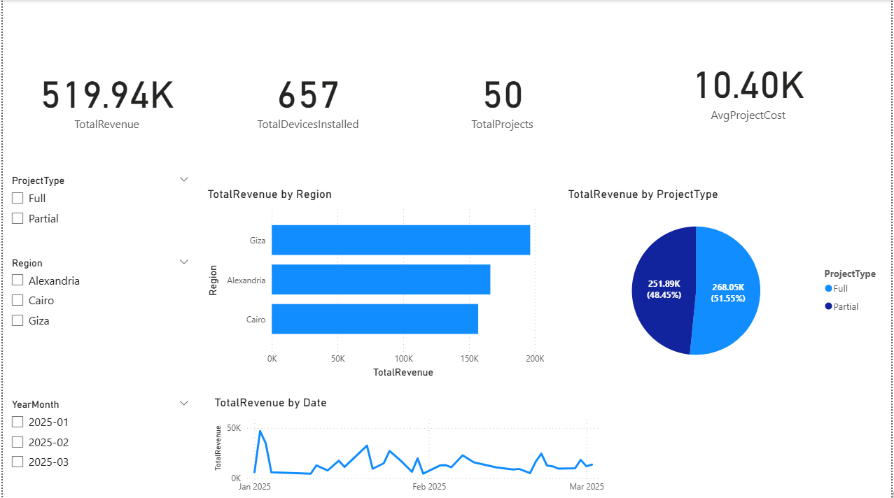

# Smart Home Installation Projects — Analytics Pipeline

A small end-to-end analytics project tracking installation projects for a smart
home services company across three regions (Cairo, Giza, Alexandria). Built to
practice — and show — a realistic **Excel → Python → Power BI** workflow rather
than a single notebook.

> Note: this uses a synthetic 50-row sample dataset, built to mimic a real
> installation-services business, for demonstration purposes.

## Pipeline

```
raw export (Excel)                Python (pandas)              Power BI
┌──────────────────┐    clean   ┌──────────────────┐  enrich  ┌──────────────────┐
│ raw_projects.csv  │ ─────────▶ │ ...with_calc.csv │ ───────▶ │ projects_clean   │ ──▶ Dashboard
│ currency text,    │  formatting│ numeric costs,   │ scripts/ │ + ProjectMonth   │
│ M/D/YYYY dates     │            │ ISO dates        │ transform.py│  for trends    │
└──────────────────┘            └──────────────────┘          └──────────────────┘
```

1. **Excel** — raw export had currency strings (`" $15,754.00 "`) and inconsistent
   `M/D/YYYY` dates. Cleaned to plain numeric costs and ISO dates, with
   `Discount` and `RevenueAfterDiscount` calculated per project.
2. **Python (pandas)** — [`scripts/transform.py`](scripts/transform.py) parses
   dates and derives a `ProjectMonth` column for time-based aggregation.
   [`scripts/analyze.py`](scripts/analyze.py) runs the exploratory analysis
   below and generates the chart assets.
3. **Power BI** — [`dashboard/smart_home_dashboard.pbix`](dashboard/smart_home_dashboard.pbix)
   visualizes total projects, revenue by region, and a per-project Gantt-style
   monthly timeline.

## Key insights

Computed from `scripts/analyze.py` on the cleaned dataset (50 projects):

- **$519,943.95** total revenue after discount on **$563,777.00** of listed
  project cost — an average discount of **7.8%**.
- **Giza** is the strongest region by revenue (**$196,617**, 17 projects),
  ahead of Alexandria (**$166,276**, 16 projects) and Cairo (**$157,051**,
  17 projects) — despite all three regions running a similar number of jobs.
- **Partial installations** generate more revenue *per project* on average
  (**$11,450** vs **$9,573** for Full installs), even though Full installs
  are more common (28 vs 22) — worth a follow-up on pricing strategy.
- Average project duration is consistent across types (~9.2 days), so the
  revenue gap isn't a turnaround-time effect.
- **657** total devices installed across all projects, January was the busiest
  month (28 projects, $280,749 revenue) before tapering into March.

| Revenue by Region | Monthly Trend | Project Type Split |
|---|---|---|
|  |  |  |

## Dashboard preview



*Executive Summary page — headline KPIs (revenue, devices installed, project
count, average cost) plus region and project-type breakdowns.*

## Repo structure

```
.
├── assets/                 # generated charts + dashboard screenshot
│   ├──dashboard_preview.png
│   ├──monthly_revenue_trend.png
│   ├──project_type_split.png
│   └──revenue_by_region.png
├── dashboard/
│   └── smart_home_dashboard.pbix
├── data/
│   ├──  processed/           # output of transform.py
│   │    └──projects_clean.csv
│   └──raw/                 # original export
│      └──raw_projects.csv
├── excel/                   # Excel-cleaned intermediate file
│   └──smart_home_projects_with_calculations.csv
├── scripts/
│   ├── transform.py         # date parsing + ProjectMonth enrichment
│   └── analyze.py           # EDA, summary stats, chart generation
├── LICENSE
└── README.md
```

## Running it

```bash
pip install -r requirements.txt
python scripts/transform.py
python scripts/analyze.py
```

This regenerates `data/processed/projects_clean.csv` and the chart images in
`assets/`. Open `dashboard/smart_home_dashboard.pbix` in Power BI Desktop to
explore the interactive dashboard.

## Tools

`Excel` · `Python (pandas, matplotlib)` · `Power BI`

---
Built by Haneen Ayman
